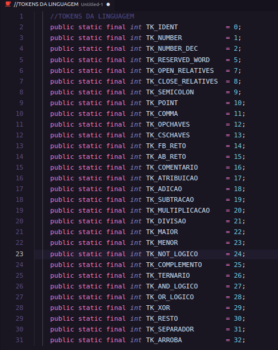
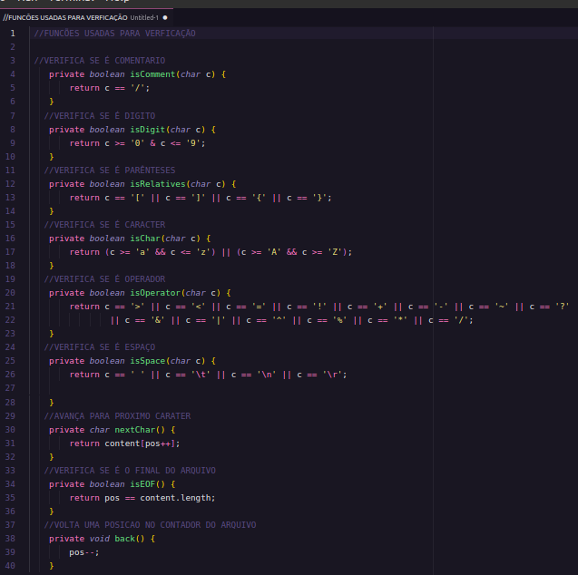
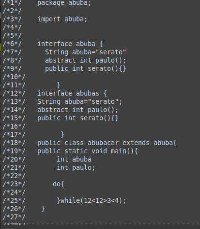
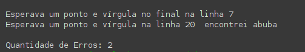
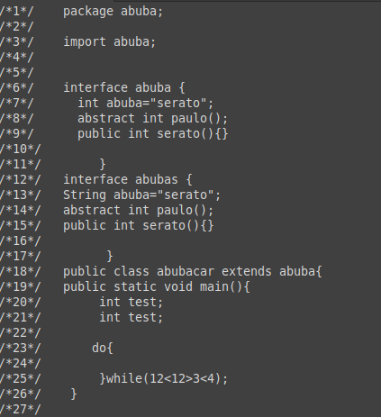
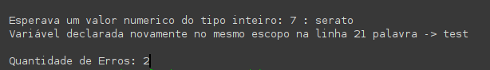

# MINI COMPILADOR - Java
Apresento a implementação do meu Mini-Compilador, criado a partir da linguagem Java tendo como linguagem de estudo a linguagem Java. Para o desenvolvimento do compilador, não usou-se bibliotecas, a baixo apresento os tokens usados para validar os caracteres no programa, algumas funções auxiliares usadas para verificação dos caracteres encontrados e o seu funcionamento.

## ANÁLISE LÊXICA
Programa criado em java para analisar a estrutura lêxica
da linguagem java.

## Tokens Usados


## Funções Auxiliares


## Funcionamento
Este analisador, verifica caracter por caracter digitado no programa
ou ainda num ficheiro de texto, e gera tokens correnspondes a conjuntos
de caracteres ou a um caracter que corresponde a estrutura lêxica da
linguagem Java.

### ENTRADA

```Java
int soma(int a, int b){
return (a+b);
}
```
### SAIDA

```Java
TOK_INT ------------------------- LEXEMA: int
TOK_IDENTIFICADOR ---------  -------- LEXEMA: soma
TOK_A-PARANTESES -------------------- LEXEMA: (
TOK_INT ------------------------- LEXEMA: int
TOK_IDENTIFICADOR ---------  -------- LEXEMA: a
TOK_VIRGULA ------------------------- LEXEMA: ,
TOK_INT ------------------------- LEXEMA: int
TOK_IDENTIFICADOR ---------  -------- LEXEMA: b
TOK_F-PARENTESES -------------------- LEXEMA: )
TOK_A-CHAVES ------------------------ LEXEMA: {
TOK_RETURN ------------------------- LEXEMA: return
TOK_A-PARANTESES -------------------- LEXEMA: (
TOK_IDENTIFICADOR ---------  -------- LEXEMA: a
TOK_ADICAO -------------------------- LEXEMA: +
TOK_IDENTIFICADOR ---------  -------- LEXEMA: b
TOK_F-PARENTESES -------------------- LEXEMA: )
TOK_P-VIRGULA ----------------------- LEXEMA: ;
TOK_F-CHAVES ------------------------ LEXEMA: }
```

 


## ANÁLISE SINTÁTICA
## Funcionamento
A implementação do meu analisador sintático foi escrito com a linguagem java, tendo como linguagem de estudo a linguagem java. A implementação do analisador sintático baseou-se na analise dos tokens que foram gerados no analisador léxico.

### ENTRADA


### SAÍDA



## ANÁLISE SEMÂNTICA
## Funcionamento
O objetivo dessa etapa é verificar se a semântica do programa fonte tem consistência. Para isso é utilizada a árvore sintática construída na fase anterior e as informações contidas na tabela de símbolos.

### ENTRADA


### SAÍDA



## VERSÕES
### Versão 1.1
+ Versão em linha de comando
### Versão 2.0
+ Bug de Numeros inteiros e decimais resolvido
+ Bug dos Parênteses resolvido
+ Interface Adicionada
### Versão 2.3
+ Tratamento de erros melhorado
+ Bugs de comentarios resolvido
+ Adicionando comentários ao código

### Versão 2.5
+ Construção Tabela de Símbolos
+ Implementação da Análise Sintática (Para linha de comando)

### Versão 3.0 (Atual)
+ Construção da Árvore sintática
+ Correção de bugs sintáticos
+ Implementação da Análise Semântica (Para linha de comando)


