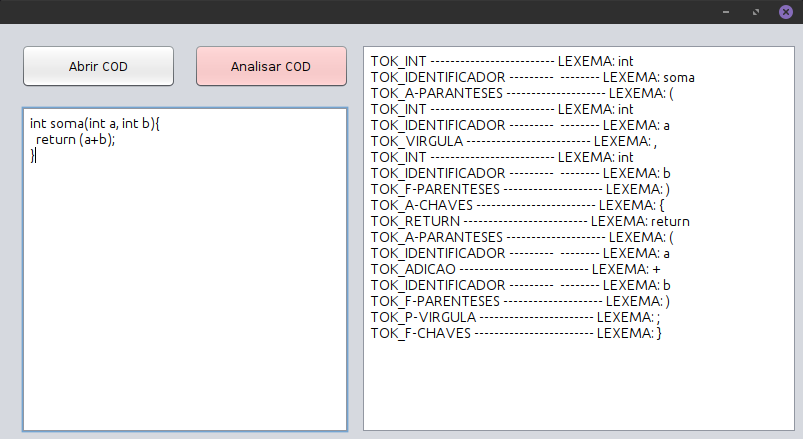

# AnalisadorLexico-Java
Programa criado em java para analisar a estrutura lêxica
da linguagem java.

## Funcionamento
Este analisador, verifica caracter por caracter digitado no programa
ou ainda num ficheiro de texto, e gera tokens correnspondes a conjuntos
de caracteres ou a um caracter que corresponde a estrutura lêxica da
linguagem Java.

### Exemplo - ENTRADA

```Java
int soma(int a, int b){
return (a+b);
}
```
### SAIDA

```Java
TOK_INT ------------------------- LEXEMA: int
TOK_IDENTIFICADOR ---------  -------- LEXEMA: soma
TOK_A-PARANTESES -------------------- LEXEMA: (
TOK_INT ------------------------- LEXEMA: int
TOK_IDENTIFICADOR ---------  -------- LEXEMA: a
TOK_VIRGULA ------------------------- LEXEMA: ,
TOK_INT ------------------------- LEXEMA: int
TOK_IDENTIFICADOR ---------  -------- LEXEMA: b
TOK_F-PARENTESES -------------------- LEXEMA: )
TOK_A-CHAVES ------------------------ LEXEMA: {
TOK_RETURN ------------------------- LEXEMA: return
TOK_A-PARANTESES -------------------- LEXEMA: (
TOK_IDENTIFICADOR ---------  -------- LEXEMA: a
TOK_ADICAO -------------------------- LEXEMA: +
TOK_IDENTIFICADOR ---------  -------- LEXEMA: b
TOK_F-PARENTESES -------------------- LEXEMA: )
TOK_P-VIRGULA ----------------------- LEXEMA: ;
TOK_F-CHAVES ------------------------ LEXEMA: }
```
### Versão 1.1
+ Versão em linha de comando
### Versão 2.0
+ Bug de Numeros inteiros e decimais resolvido
+ Bug dos Parênteses resolvido
+ Interface Adicionada
### Versão 2.3 (Atual)
+ Tratamento de erros melhorado
+ Bugs de comentarios resolvido
+ Adicionando comentários ao código

 
